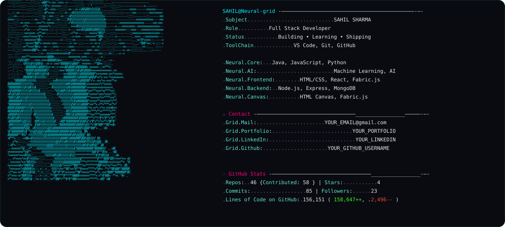

# Hi 👋 I'm Sahil Sharma

<p align="center">
  
</p>

<p align="center">
  <a href="https://github.com/YOUR_GITHUB_USERNAME">
    
  </a>
  <a href="https://www.linkedin.com/in/YOUR_LINKEDIN_USERNAME/">
    
  </a>
  <a href="mailto:YOUR_EMAIL@gmail.com">
    
  </a>
</p>

<p align="center">
  
</p>

---

## 👨‍💻 About Me

- 🎓 B.Tech Information Technology @ **D. Y. Patil University**
- 📊 CGPA: **9.25 / 10**
- 💻 MERN Stack & Java Full Stack Developer
- 🏆 Student Coordinator – Training & Placement Cell
- 🤖 Completed **Machine Learning**
- 🎨 Currently working with **HTML Canvas & Fabric.js**
- 🖼️ Exploring image editing, enhancement, cropping and pixel manipulation
- 🧠 Interested in AI-powered applications
- 🎯 Goal: Become a **Production AI Engineer**

---

# 🛠️ Tech Stack

## 💻 Languages

<p>
  
</p>

---

## ⚛️ Frontend

<p>
  
</p>

- React.js
- HTML Canvas
- Fabric.js
- Responsive UI
- JavaScript

---

## ⚙️ Backend

<p>
  
</p>

- Node.js
- Express.js
- MongoDB
- REST APIs
- JWT Authentication
- MVC Architecture

---

## 🤖 AI & Machine Learning

<p>
  
</p>

- Machine Learning ✅
- AI Fundamentals
- OpenAI APIs
- Generative AI
- AI-powered applications

---

## 🧰 Tools & Services

<p>
  
</p>

- Git
- GitHub
- VS Code
- Cloudinary
- Render

---

# 🚀 Featured Projects

## 🏠 House Rent Marketplace

A full-stack rental marketplace built using the MERN stack.

### 🔧 Tech Used

- React.js
- Node.js
- Express.js
- MongoDB
- JWT Authentication
- Cloudinary
- REST APIs
- MVC Architecture
- Render

### ✨ Features

- 🔐 User authentication
- 🏠 Property listings
- 🔎 Property discovery
- 📸 Image uploads
- ☁️ Cloudinary integration
- 🔒 Protected routes
- 🚀 Production deployment

---

## 🌐 Developer Portfolio

A responsive developer portfolio built with React.

### ✨ Features

- ⚛️ React.js
- 📱 Responsive design
- ⚡ Performance focused
- 🎨 Modern UI
- 📂 Project showcase

---

# 🎨 Canvas Image Editor

Currently working with **HTML Canvas and Fabric.js** to understand how image editors work at the pixel and object level.

### 🖼️ Image Features

- ☀️ Brightness
- 🌓 Contrast
- 🌈 Saturation
- ⚫ Grayscale
- 🔄 Invert
- 🎨 Hue Rotation
- 🌫️ Blur
- 🔍 Sharpness
- ✂️ Image Cropping

### 🎯 Canvas Concepts

- Canvas rendering
- Pixel manipulation
- Image objects
- Fabric.js objects
- Image filters
- Object transformations
- Scaling
- Canvas coordinates
- Image cropping
- Multiple canvas architecture

---

# 🧩 Multi-Canvas Editor

Currently building a multi-canvas editor architecture using React and Fabric.js.

```text
                    Editor
                      │
          ┌───────────┼───────────┐
          │           │           │
       Canvas 1    Canvas 2    Canvas 3
          │           │           │
       Objects     Objects     Objects
          │           │           │
       ┌──┼──┐     ┌──┼──┐     ┌──┼──┐
       Text Image  Text Image  Text Clipart
